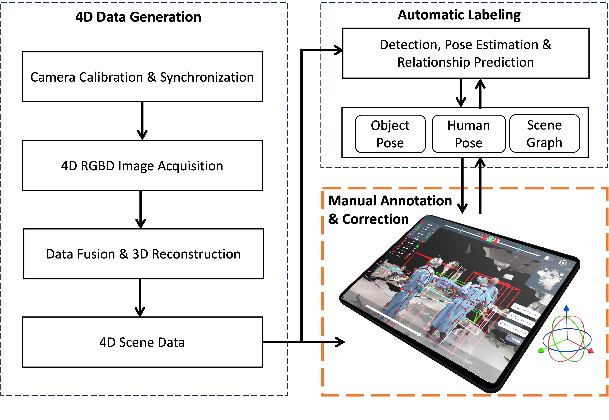

# Leveraging Motion Tracking for Intuitive Interactions in a Tablet-Based 3D Scene Annotation System

## Abstract
We introduce an innovative system tailored for three annotation tasks pertinent to 4D scene data: bounding box creation, human pose adjustment, and relationship annotation. This system introduces two distinct interaction methods - touch-based and hybrid (combining touch with device motion tracking) - each optimized for the specified tasks.

[](https://youtu.be/aY2Rh6mV7vI)

## Annotation System Design
Our tablet-based annotation system is positioned as a critical intermediary in the 4D scene data generation and analysis pipeline, aimed at facilitating human-in-the-loop corrections and refinements.

<p align="center">
	
</p>

### Bounding Box Creation

In touch-based mode, annotation is aided by two orthogonal views, each defining a 2D bounding box to form a 3D bounding box. 

In hybrid mode, touching an object creates a default bounding box, adjustable in size and position by dragging its surfaces.
<p align="center" width="100%">
    <table>
        <tr>
            <td align="center" width="45%">
                <br>
                Bounding Box Creation (Touch)
            </td>
            <td align="center" width="45%">
                <br>
                Bounding Box Creation(Hybrid)
            </td>
        </tr>
    </table>
</p>

### Human Pose Adjustment

In touch-based mode, 3 DoF adjustments are made via translations along X, Y, Z axes, using orthogonal views as interaction planes. 

In hybrid mode, the tablet, acting as an extension of the user’s hand, allows joint positioning through natural movements.
<p align="center" width="100%">
    <table>
        <tr>
            <td align="center" width="45%">
                <br>
                Human Pose Adjustment (Touch)
            </td>
            <td align="center" width="45%">
                <br>
                Human Pose Adjustment (Hybrid)
            </td>
        </tr>
    </table>
</p>

### Relationship Annotation

In touch-based mode, a user touches the screen to select the first 3D subject and releases to select the second. They then choose a relationship to connect them. 

In hybrid mode, users use a crosshair and a 'connect' button to select two subjects and then pick a relationship from a list that appears.
<p align="center" width="100%">
    <table>
        <tr>
            <td align="center" width="45%">
                <br>
                Relationship Annotation (Touch)
            </td>
            <td align="center" width="45%">
                <br>
                Relationship Annotation (Hybrid)
            </td>
        </tr>
    </table>
</p>


## Cite Us

```
@inproceedings{song2023leveraging,
  title={Leveraging Motion Tracking for Intuitive Interactions in a Tablet-Based 3D Scene Annotation System},
  author={Song, Tianyu and Eck, Ulrich and Navab, Nassir},
  booktitle={2023 IEEE International Symposium on Mixed and Augmented Reality (ISMAR)},
  pages={563--572},
  year={2023},
  organization={IEEE}
}
```
